# Continuos GAN

Train continuos GAN with simple objective: $`\min\limits_{\psi} \max\limits_{\theta} \mathbb{E}_{t \sim [0, 1], x_0, x_1} \lambda(t) \langle \text{score}_\theta (x_t, t) , E_\psi(x_t, t) - (x_1 - x_0)\rangle`$. Then sample from ODE using $`E_\psi(x_t, t)`$

## Formulation

### Discrete case

Start definition with discrete time. First of all, define $`x_t = (1 - t) x_0 + t x_1`$, where $`x_0 \sim p(x_0)`$ - data to generate, $`t \in [0, 1]`$ - time and $`x_1 \sim \mathcal{N}(x_1, 0, I)`$. $`x_0`$ and $`x_1`$ are independent in simplest case. So, in $`t=0`$ and $`t=1`$ distributions are fixed. 

It can be viewed as diffusion model, but there are $`\alpha_t`$ and $`\sigma_t`$, here for simplicity $`\alpha_t = 1 - t`$ and $`\sigma_t = t`$. Using ideas from [Neural Flow Diffusion Models](https://arxiv.org/pdf/2404.12940) set $`x_t = (1 - t) x_0 + t x_1 + t (1 - t) F_\phi(x_0, x_1, t)`$, may be with other coefficients. Also there is opportunity to use other process to set current process: $`x_t = (1 - t) x_0 + t x_1 + t (1 - t) F_\phi(x_0, x_1, t, \epsilon_t)`$. Now focus on simplest case.

Our task - fit model $`E_\psi(x_t, t)`$ to reconstruct $`p(x)`$. By induction if we can reconstruct $`p(x_t)`$ with our procedure (with $`E_\psi(x_t, t)`$) than for training use sampling $`p(x_t)`$ and just learn to reconstruct $`p(x_{t-dt})`$ (by already knowing $`p(x_t)`$).

Start optimization with coefficients $`\lambda(t)`$. For every step use [Wasserstein GAN](https://arxiv.org/pdf/1701.07875). Our objective is $`\min\limits_{\psi} \max\limits_{\theta, \|D_\theta\|_L \le 1} \sum_{t} \lambda(t) \left[\mathbb{E}_{x_{t-dt} \sim p(x_{t-dt})} D_\theta (x_{t-dt}, t) - \mathbb{E}_{q_\psi(x_{t-dt} | x_t), p(x_t)} D_\theta (x_{t-dt}, t) \right]`$

For $`q_\psi(x_{t-dt} | x_t)`$ can be used different distributions. Also we can use $`F_\phi`$ or even $`\dfrac{\partial F_\phi}{\partial t}`$ here, but with our own $`\hat{x_0}`$ and $`\hat{x_1}`$. In simplest case use $`q_\psi(x_{t-dt} | x_t) = x_t -  dt E_\psi(x_t, t)`$. It allow us to go into continuos time and also use ODE sampler. If we use $`F_\phi`$, then $`q_\psi(x_{t-dt} | x_t) = x_t - dt \dfrac{\partial F_\phi}{\partial \hat{t}}(\hat{x_0}, \hat{x_1}, \hat{t}=t)`$, but it needs to do some proof about usage of WGAN in case when we do not have fixed distribution, may be need to add some limits on $`F_\phi`$ for that. 

In simplest case without using another process $`\epsilon_t`$ (there will also can do that, but not in so simple form) we can just simply rewrite our objective: $`\min\limits_{\psi} \max\limits_{\theta, \|D_\theta\|_L \le 1} T \mathbb{E}_{t, x_0, x_1} \lambda(t) \left[D_\theta (x_{t-dt}, t) - D_\theta (x_t - dt E_\psi(x_t, t), t) \right] = \min\limits_{\psi} \max\limits_{\theta, \|D_\theta\|_L \le 1} \mathbb{E}_{t, x_0, x_1} \lambda(t) \frac{D_\theta (x_{t-dt}, t) - D_\theta (x_t - dt E_\psi(x_t, t), t)}{dt}`$

### Continuos case

Thanks to WGAN, difference between discriminators is equal to $`0`$, so use $`\lim\limits_{dt \to 0}`$: $`\min\limits_{\psi} \max\limits_{\theta, \|D_\theta\|_L \le 1} \mathbb{E}_{t \sim [0, 1], x_0, x_1} \lambda(t) \left[ - \partial D_\theta (x_t, t) \partial x_t + \partial D_\theta (x_t, t) E_\psi(x_t, t)\right] = \min\limits_{\psi} \max\limits_{\theta, \|D_\theta\|_L \le 1} \mathbb{E}_{t \sim [0, 1], x_0, x_1} \lambda(t) \left[ \partial D_\theta (x_t, t) ( E_\psi(x_t, t) - (x_1 - x_0)) \right]`$

### Lipschitz constant

For defining $`\partial D_\theta (x_t, t), \|D_\theta\|_L \le 1`$ simply use other network. This network enough to have bounded norm. For that we use $`\text{out}_\text{new} = \text{out} \frac{ \text{tanh}(\|\text{out}\|_2)}{\|\text{out}\|_2}`$, where $`\text{out}= \text{score}_\theta (x_t, t)`$

Final objective: $`\min\limits_{\psi} \max\limits_{\theta} \mathbb{E}_{t \sim [0, 1], x_0, x_1} \lambda(t) \langle \text{score}_\theta (x_t, t) , E_\psi(x_t, t) - (x_1 - x_0)\rangle`$. In case with $`F_\phi`$ use jvp here for deriving, and using $`\epsilon_t`$ is somehow harder to derive. Good step here is to use not $`E_\psi(x_t, t)`$, but $`\hat{x_0}`$ or/and $`\hat{x_1}`$. 

Now we explicitly set borders for Lipschitz constant. It is better than in WGAN, where we use tricks. 

### ODE

We can use $`E_\psi(x_t, t)`$ for ODE solving and sampling $`x_0`$. Simply use [torchdiffeq](https://github.com/rtqichen/torchdiffeq).

### Condition on x

We can add $x_0$ and $x_1$ as a conditions to \text{score}_\theta (x_t, x_0, x_1, t)$. Intuitively, we reduce not the distance to the average, but the average of all distances. But there is no proofs that it works :)

With contition on $x_0$ or/and $x_1$: $`\min\limits_{\psi} \max\limits_{\theta} \mathbb{E}_{t \sim [0, 1], x_0, x_1} \lambda(t) \langle \text{score}_\theta (x_t, x_0, x_1, t) , E_\psi(x_t, t) - (x_1 - x_0)\rangle`$. Then also sample from ODE using $`E_\psi(x_t, t)`$

### Discussion

Intuitively, for every $`x_t`$ model should approximate weighted mean of $`x_1 - x_0`$. But it is hard problem, because need to sample a lot for accurate approximation. That is why using information about $`x_0`$ or $`x_1`$ can be useful (may be with ideas from Bridge models). It will something like using ELBO in VAE and diffusion models.

Also it can be useful to use $`F_\phi`$ and $`\epsilon_t`$, because it simplifies work for $`E_\psi`$ and make our process wider. 

Another idea is to go into the latent space, just using prior loss and reconstruction loss, may we with GAN or WGAN ideas. May be it will fix some dimensionality problems.

If we have known distributions and want to create bridge, may be we can use similar formulas, just say that optimum is when we know weighted mean of $x_1 - x_0$ with condition on $x_t$. And calculate formulas for simple distributions. 

## Results

In current repository you can see $`3`$ implementations - for simple 1D case and for CIFAR10 with using $`F_\phi(x_t, t)`$ (without additional limits and proving of correctness) and simple version with $`x_1 - x_0`$. In both cases model works not so good, it is unstable and generates bad samples.

In CIFAR10 we can see many image parts similar to real images, but the quality is bad. May be we should tune parameters (because of gans problems), may be implements some ideas from discussion, but may be I am wrong somethere. But generations that are sometimes good and formulas simplicity and beauty gives me hope :) And also with simple objective I start to get good results, so may be problem with case with $`F_\phi`$ and we should research WGAN theory to work with both non-fixed distribution or may be problem not in that...

## Why it can be important

We already know how to reconstruct distribution using Flow Matching (and can do it in continuos case), but it have strict restrictions, for example function must be invertible. We can use expectation maximization for sampling something that we know pdf, or in stable case VAE. To add complexity (and model control) we use HVAE and Diffusion models, and finally we can go into continuos case. 

But GAN is different, it can work not with pdf, but with measures. It already works good with many samplings. But can we use something like ELBO and continuos time for that?

We can try to use same road as sampling with pdf -> Diffusion. Current work is about continuos time for GANS. But there are many other questions:
1. Can we go into latent space, and instead of using $`x_t = (1 - t) x_0 + t x_1 + t (1 - t) F_\phi(x_0, x_1, t)`$ just say that we can use only $`F_\phi(x, t)`$ and just use something like prior, reconstruction and diffusion losses?
2. Can we use even $`x_t = (1 - t) x_0 + t x_1 + t (1 - t) F_\phi(x_0, x_1, t)`$ (can WGAN work when all distributions are not fixed)? Now we have something like a proof only for $`x_t = (1 - t) x_0 + t x_1`$ and may be results with $`F_\phi`$ are worse. But may be with some restrictions they will be better;
3. In addition to first can we use not only $`F_\phi(x_0, x_1, t)`$ but some process $`\epsilon_t`$, or things are harder?
4. Can we use conditions on $`x`$ and others, like in ELBO? Just to more stable training ($`score`$ will get it as an input);
5. In discrete case we can try to use $`x_t`$ as a condition;
6. And can we do Bridges in latent space?
7. We can also use conditions of other processes and samples. Also combinations of models, for example stack of diffusions, may be using prior and reconstruction loss we can do it in latent space for different sizes.
8. We can got other formulas simply using other parametrizations. For example, $`D_\theta (x_{t-dt}, t) = 0 - dt \hat{D_\theta} (\dots, t)`$ or $`D_\theta (x_{t-dt}, t) = 0 - dt \dfrac{\partial D_\theta}{\partial \dots} (\dots, t)`$ and use simple GAN objective (you can add $`x_t`$ in condition) or Neural Optimal Transport or something other;
9. Work with $`\lambda(t)`$.

So, this work is about trying to use measures in generation task.

Also in diffusion models we can add prior loss and reconstruction loss and learnable variance that is different for $`p`$ and $`q`$ and can depend on $`x`$. We can also add some condition from sampled variables.

## Run:

Create logs folder before running 

1. CIFAR10 with $`F_\phi`$ (additional param if linear case, but with prediction both $`x_0`$ and $`x_1`$): `nohup python3 train_images.py --device "cuda:0" >> logs/contgan_images.txt &`
1. CIFAR10 linear: `nohup python3 train_images_simple.py --device "cuda:0" >> logs/contgan_images_simple.txt &`
3. 1D: `nohup python3 train1d.py --device "cuda:0" >> logs/contgan1d.txt &`

## Generation examples (from different models, for example for CIFAR better are last with simple objective):

For cifar we use 6.3 mln params for every part. But architecture, num steps and learning params were select near random, so results can be much better.

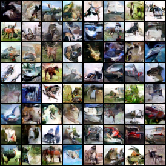

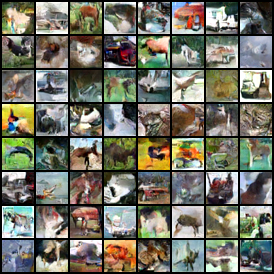

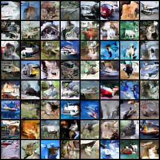

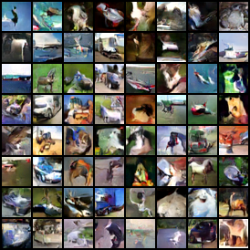

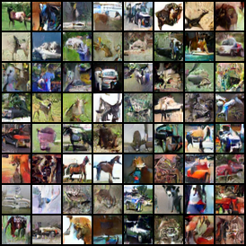

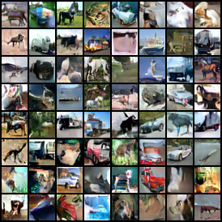

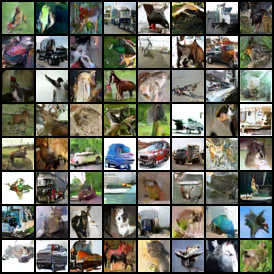

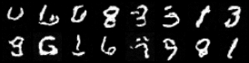

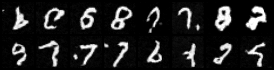

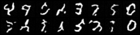

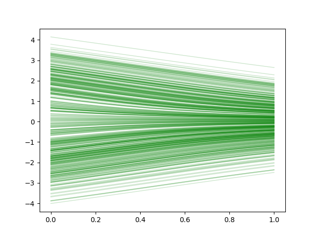